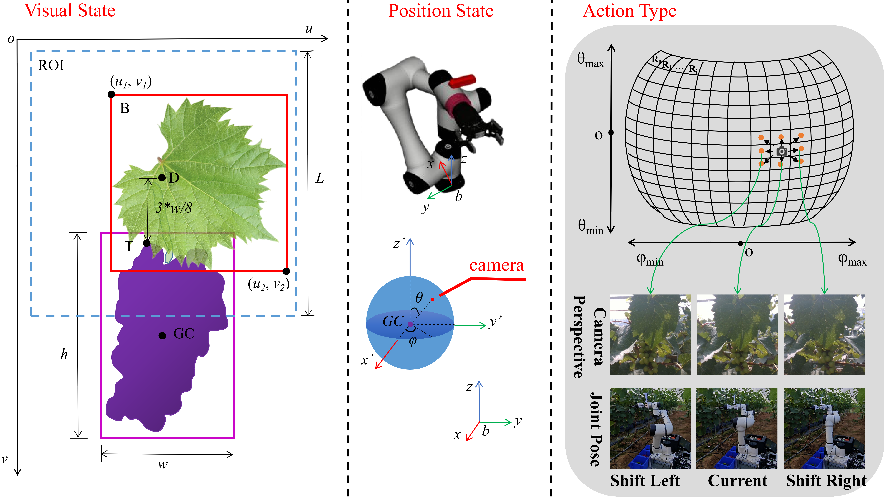

# MutiViewGrapeDatasets
       A multi-view grape dataset was constructed by collecting data from grape targets under different occlusion conditions 
in real outdoor environments for training the action classification model. 
The data collection process consisted of two steps. First, the spherical workspace of camera motion was discretized into a finite number of grid regions (Regions), with the center of each region $R_i$ selected as the viewpoint sampling position. Second, the robotic arm sequentially moved a RealSense D435 depth camera mounted on its end effector to these sampling positions to acquire the RGB and depth images, together with the corresponding robot joint states. In total, the training set comprised 3087 viewpoints from 21 grape targets, while the test set comprised 441 viewpoints from 3 grape targets. Each viewpoint was associated with an RGB image, a depth image, and a robot joint state.

As shown in Figure, during data collection, the camera viewpoints are constrained to lie on a spherical surface centered at the grape cluster centroid
$GC$ with a radius $R$. The camera position is represented as $p = [R, θ, φ]^T$. The center point of each region $R_{i}$ on the sphere is selected as a sampling 
point, and the robotic arm is controlled to move the camera to these points for data acquisition. The action types are represented by the action type list $AT = [at^{1}, at^{2}, ..., at^{N^{k}}]$.
Eight specific action types are defined, namely $(0, +\Delta\theta)$, $(+\Delta\phi, +\Delta\theta)$, $(+\Delta\phi, 0)$, $(+\Delta\phi, -\Delta\theta)$, $(0, -\Delta\theta)$, $(-\Delta\phi, -\Delta\theta)$, $(-\Delta\phi, 0)$, 
$(-\Delta\phi, +\Delta\theta)$.

The CSV file contains the following information:

1.Image name. Note that $rgb\\_n$ corresponds to the depth image $depth\\_n$

2.Camera position $p.φ$

3.Camera position $p.θ$

4.Viewpoint index after executing $(0, +\Delta\theta)$ ($index = 200$ indicates the action cannot be performed)

5.Viewpoint index after executing $(+\Delta\phi, +\Delta\theta)$

6.Viewpoint index after executing $(+\Delta\phi, 0)$

7.Viewpoint index after executing $(+\Delta\phi, -\Delta\theta)$

8.Viewpoint index after executing $(0, -\Delta\theta)$

9.Viewpoint index after executing $(-\Delta\phi, -\Delta\theta)$

10.Viewpoint index after executing $(-\Delta\phi, 0)$

11.Viewpoint index after executing $(-\Delta\phi, +\Delta\theta)$

12.Joint angles of the 6-DOF robotic arm $q = [q_{1}, q_{2}, q_{3}, q_{4}, q_{5}, q_{6}]$
